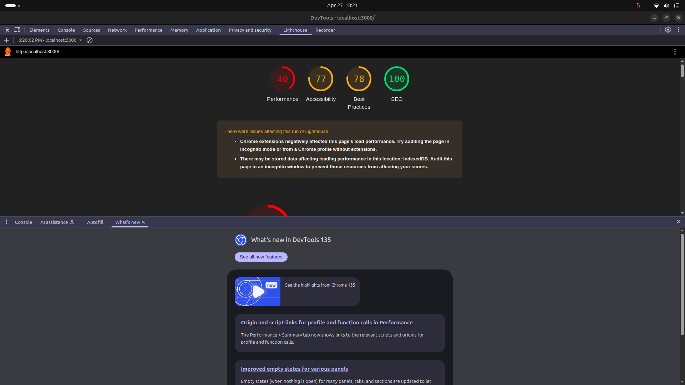

// créer un Plan de test simple ;

A. Les Fonctionnalités à tester
✅ L’affichage de la liste de voitures
✅ Le filtre par nom fonctionne
✅ Le filtre par prix minimum fonctionne
✅ Le filtre par prix maximum fonctionne
✅ Le lien "Voir plus" ouvre la bonne page
✅ Les données affichées sont correctes (nom, prix, image)
✅ Aucun bug visuel même si la liste est vide

//***/le tableau d'elements a tester ; 
-----------------------------------------------------------------------------------------------------------------------------------------------------------------------------------------------------

# Plan de Test - Projet de Scraping de Voitures (Tests Fonctionnels)

| ID Test | Type de Test         | Fonctionnalité         | Étapes pour tester | Résultat attendu | Statut (PASS/FAIL) | Commentaire |
|--------|----------------------|-------------------------|--------------------|------------------|-------------------|-------------|
| T001   | Test Fonctionnel      | Affichage des voitures  | Ouvrir la page      | La liste s'affiche correctement    |      done       |
| T002   | Test Fonctionnel      | Recherche par nom       | Rechercher "Toyota" | Seules les voitures "Toyota" affichées     |    done         |
| T003   | Test Fonctionnel      | Filtre Prix Min         | Entrer 10 000 TND   | Aucune voiture < 10 000 TND |               |done
| T004   | Test Fonctionnel      | Filtre Prix Max         | Entrer 20 000 TND   | Aucune voiture > 20 000 TND |               |done
| T005   | Test Fonctionnel      | Lien Voir Plus          | Cliquer sur "Voir plus" | Bonne page ouverte |               |msg This site can’t be reached , not yet
| T006   | Test Fonctionnel      | Comportement liste vide | Simuler liste vide | Message "Aucune voiture trouvée" |               |
| T007   | Test d'Interface       | Vérifier les champs filtres | Regarder design des inputs | Inputs visibles et alignés |        done         |
| T008   | Test d'Interface       | Vérifier responsive     | Réduire la fenêtre (mobile) | Le site s'adapte correctement |             done   |
| T009   | Test de Robustesse    | Entrée invalide dans filtres | Entrer des lettres dans prix | Message d'erreur ou filtre ignoré |     impo d'input lettre , done           |
| T010   | Test de Performance    | Vitesse d'affichage     | Charger 50 voitures | Chargement rapide sans bug |          done     |

#  Tests d’Interface (UX/UI)
Le design est-il propre ?  oui

Vérifier :

Inputs visibles, bien alignés  oui

Boutons accessibles    oui 

Responsive sur mobile/tablette   oui 

Image bien affichée   oui 

Couleurs lisibles   oui 
simple et bien structuré 

# Tests de Performance (Non Fonctionnels) 
charge rapide we use  lighthouse for chrome to mesurer the speed and UX 
F then go to lightouse and run the test u will have ratio of everything u need 
as a first try i had 

# 🛡️ Tests de Robustesse
Entrer des lettres dans le champ "Prix" done

Laisser un champ vide   done  

Entrer une valeur absurde (ex : -1000 TND)  done

#  Tests de Sécurité
Vérifier que tous les liens (a href) sont sécurisés avec :

rel="noopener noreferrer"
target="_blank"   DONE 

# Tests de Flux 
Teste comme si tu étais un vrai utilisateur :

Ouvrir site  done 

Chercher une voiture  done "toyota" 

Filtrer par prix  done min et max 15000 min et max 30000

Cliquer sur Voir Plus  not yet prob lien de direction 

Vérifier que tout fonctionne sans erreur   all is good sof direction du lien 

# Tests de Régression 
done modification de performance du code avec des composants rien  n'a changé 

# on passe ainsi a Tests Automatisés ne pas oublier les test unitaires 

